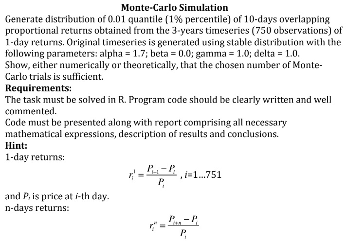
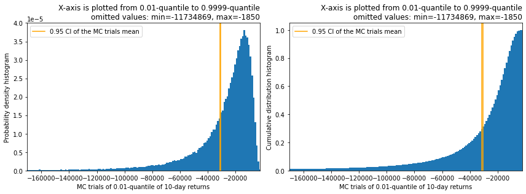
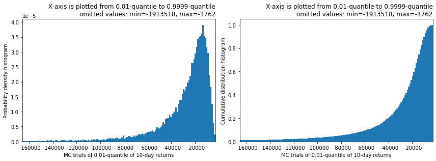

---
pandoctools:
  profile: Simple
  out: "*.docx"
toc: true
...

# 1. Formulation of the problem

This report summarises results obtained from solving the problem given on this picture:



I interpreted this problem two times. First I assumed that the problem was 1) (see below). But after I implemented 1) I revisited the original problem description and understood that the problem presumably was 2) (see below). Hence I implemented 2) too and this report contains two corresponding parts. 

1) **Problem A**: To calculate 0.01-quantile of a particular random variable via Monte Carlo simulation (MCS). Realizations of a random variable are given by samples from a particular distribution. On each step of the MCS the sample from this distribution is generated (that is a sample of 10-day returns obtained from a 750-sized sample of 1-day returns). Each MC trial generates approximation to the 0.01-quantile. MCS stop criteria is given by 0.95 confidence interval of 0.01-quantile estimation.

2) **Problem B**: To generate a representative sample from a particular distribution via Monte Carlo simulation. To get a sample element from the distribution one should a) sample 750 1-day returns, b) convert them to 10-day returns, c) get 0.01-data-quantile of 10-day returns. This data-quantile is the sample element (aka the realization of a random variable). MCS stop criteria is until the accumulated sample is representative. Data-quantile is a formal mapping in this case.

See mode details in the corressponding sections.


# 2. Shared derivations

## 2.1 1-day returns

1-day returns are given by $R$ random variable. $R \sim \mathrm{Stable}(\alpha=1.7,\beta=0,c=1,\mu=1)$. Where $c=\gamma,\,\mu=\delta$. $r_i^1$ are realizations of a random variable $R$. $r_i^1,\,i=1,...,N;\, N=750$.

See [Stable distribution on Wikipedia](https://en.wikipedia.org/wiki/Stable_distribution). Used implementation of [Stable distribution in scipy](https://docs.scipy.org/doc/scipy/reference/generated/scipy.stats.levy_stable.html).


## 2.2 n-day returns

n-day returns are given by formula:

$$
r_i^n = -1+\prod_{j=0}^{n-1}(r_{i+j}^1 + 1),\,i=1,...,N-n;\, N=750
$$

That is derived from the following:

1-day returns:
$$
r_i^1 = \frac{P_{i+1} - P_i}{P_i},\, i=1...751,
$$
where $P_i$ is a price at $i$-th day.  
n-day returns:
$$
r_i^{n} = \frac{P_{i+n} - P_i}{P_i},
$$

Derivation:
$$
\begin{align}
r_i^1 = (P_{i+1}-P_i) / P_i = P_{i+1}/P_i - 1, \\
P_{i+1}/P_i = r_i^1 + 1, \\
r_{i+1}^1 = (P_{i+2}-P_{i+1}) / P_{i+1} = P_{i+2}/P_{i+1} - 1, \\
P_{i+2} = (r_{i+1}^1 + 1) P_{i+1}, \\
r_i^2 = (P_{i+2}-P_i) / P_i = P_{i+2}/P_i - 1 = \\
= (r_{i+1}^1 + 1) P_{i+1}/P_i - 1 = (r_{i+1}^1 + 1) (r_i^1 + 1) - 1, \\
r_{i+n-1}^1 = (P_{i+n}-P_{i+n-1}) / P_{i+n-1} = P_{i+n}/P_{i+n-1} - 1, \\
P_{i+n} = (r_{i+n-1}^1 + 1) P_{i+n-1}, \\
r_i^n = (P_{i+n}-P_i) / P_i = P_{i+n}/P_i - 1 = (r_{i+n-1}^1 + 1) P_{i+n-1}/P_i - 1 = \\
= (r_{i+n-1}^1 + 1)(r_{i+n-2}^1 + 1) P_{i+n-2}/P_i - 1 = \\
= (r_{i+n-1}^1 + 1)(r_{i+n-2}^1 + 1)...(r_{i+1}^1 + 1)(r_i^1 + 1) - 1 = \\
= -1+\prod_{j=0}^{n-1}(r_{i+j}^1 + 1).
\end{align}
$$


# 3. Problem A

To calculate 0.01-quantile $q_{0.01}$ of a particular random variable $R^{10}$ via Monte Carlo simulation (MCS). Realizations of a random variable are given by sintetic samples ($r_i^{10}$) from a particular distribution. On each step of the MCS the sample from this distribution is generated (that is a sample of 10-day returns $r_i^{10},i=1,...,740$ obtained from a sample of 1-day returns $r_i^1,i=1,...,750$). Each MC trial generates approximation $q_{0.01}^{(n)}$ to the 0.01-quantile $q_{0.01}$ ($q_{0.01}^{(n)}$ are realizations of a random variable $Q^*$). MCS stop criteria is given by 0.95 confidence interval of 0.01-quantile estimation. The described method is valid assiming $q_{0.01}=\mathrm{E}\left(Q^*\right)$.


## 3.1 Base outline of the algorithm to solve the problem

$$
\begin{align}
P(R^{10} \le q_{0.01}) \ge 0.01, \\
P(R^{10} \ge q_{0.01}) \le 1-0.01.
\end{align}
$$

$Q_\mathrm{sample}^*$ is a list to store 0.01-quntile approximations $q_{0.01}^{(n)}$ of the $q_{0.01}$ from MC trials. Stores realizations of a random variable $Q^*$.  
$q_β^\mathrm{CI}=\left|Q_{\mathcal{N}\left(0,1^2\right)}\left(\frac{1 - β}{2}\right)\right|$ is a $β$-quantile for confidence interval estimation. $β=0.95$.  
where $Q_{\mathcal{N}\left(0,1^2\right)}$ is a [quantile function](https://en.wikipedia.org/wiki/Quantile_function) of the standard normal distribution computed via [scipy](https://docs.scipy.org/doc/scipy/reference/generated/scipy.stats.norm.html) (ppf method).
$$
\begin{align}
Z \sim \mathcal{N}(0,1^2), \\
P(|Z| > q_β^\mathrm{CI}) = 1 - β, \\
P(Z < -q_β^\mathrm{CI}) = (1 - β) / 2.
\end{align}
$$

In a loop do:

1\) on $n$-th iteration of the loop,  
2\) sample 1-day returns:

$$
r_i^1 \sim \mathrm{Stable}(\alpha=1.7,\beta=0,c=1,\mu=1),\,i=1,...,750.
$$

3\) convert to 10-day returns:

$$
r_i^{10} = -1+\prod_{j=0}^{10-1}(r_{i+j}^1 + 1),\,i=1,...,740.
$$

4\) compute 0.01-quantile of the $r_i^{10}$ sample -- $q_{0.01}^{(n)}$ via [numpy](https://numpy.org/doc/stable/reference/generated/numpy.quantile.html) and append it to the $Q_\mathrm{sample}^*$ list,  
5\) compute expected value estimate $\bar{Q}_n$ and variance estimate $S_n^2$ of the $Q_\mathrm{sample}^*$ using equations from this [stackexchange answer](https://quant.stackexchange.com/a/21769).  
6\) if $n > 30$ and condition is satisfied then exit loop and Monte Carlo simulation should stop. The condition:

$$
q_β^\mathrm{CI}S_n / \sqrt{n} < A \bar{Q}_n,
$$
where $A=0.01$ -- relative accuracy.

Let's assume that $q_{0.01}=\mathrm{E}\left(Q^*\right)$, then:

$$
\begin{align}
\mathrm{E}\left(Q^*\right)=μ,\,\, \mathrm{Var}\left(Q^*\right)=σ^2, \\
P\left( \left|\frac{\bar{Q}_n - μ}{σ / \sqrt{n}}\right| < q_β^\mathrm{CI} \right) ≈ P(|Z| < q_β^\mathrm{CI}) = β = 0.95, \\
\left|\bar{Q}_n - μ\right| < q_β^\mathrm{CI}σ / \sqrt{n} ≈ q_β^\mathrm{CI}S_n / \sqrt{n} < A \bar{Q}_n = 0.01\bar{Q}_n, \\
\bar{Q}_n = \frac{1}{n}\sum_{j=1}^n q_{0.01}^{(n)},\,\, S_n^2 = \frac{1}{n-1}\sum_{j=1}^n \left(q_{0.01}^{(n)} - \bar{Q}_n \right)^2.
\end{align}
$$

$\bar{Q}_n$ and $S_n^2$ are computed via online implementation:

$$
\begin{align}
\bar{D}_{n+1} & = \bar{D}_n + \frac{q_{0.01}^{(n+1)} - \bar{D}_n}{n+1}, \\
S^2_{n+1} & = \left(1 - \frac{1}{n}\right)S_n^2 + (n+1)(\bar{D}_{n+1} - \bar{D}_n)^2
\end{align}
$$


## 3.2 Results and discussion

See results of the calculation of the $q_{0.01}$ on the Fig. 1.



Assuming $q_{0.01}=\mathrm{E}\left(Q^*\right)$ the algorithm above should give reasonable estimate of the desired $q_{0.01}$. The assumption seems intuitive but I guess it needs proof... 


# 4. Problem B

To generate a representative sample $Q_\mathrm{sample}^*$ from a particular distribution via Monte Carlo simulation. To get a sample element from the distribution one should a) sample 1-day returns $r_i^1,i=1,...,750$, b) convert them to 10-day returns $r_i^{10},i=1,...,740$, c) get 0.01-data-quantile $q_{0.01}^{(n)}$ of 10-day returns. This data-quantile is the sample element (aka the realization of a random variable $Q^*$). MCS stop criteria is until the accumulated sample is representative. Data-quantile is a formal mapping in this case.

## 4.1 Using Two-sample Kolmogorov–Smirnov test checks if the sample is representative

*This section mostly describes why Two-sample Kolmogorov–Smirnov was useless for hypothesis testing. For the implemented algorithm see the the very end of this section.*

[Kolmogorov–Smirnov test](https://en.wikipedia.org/wiki/Kolmogorov%E2%80%93Smirnov_test) is the only test I found in the context of checks if the sample is representative. See this [stackexchange answer](https://stats.stackexchange.com/a/97552). Unfortunately it was applied to a different situation.

First idea was that if we $N_{\mathrm{tests}}$ times randomly partition $Q_\mathrm{sample}^*$ into
two subsamples of approximately equal sizes and each time two subsamples pass
Kolmogorov–Smirnov test then we decide that $Q_\mathrm{sample}^*$ is representative.
I assumed that this way when the sample size is not big enough, among random partitions would always be a partition with halves that too different (failing the Kolmogorov–Smirnov test).

I desided to use [scipy implementation](https://docs.scipy.org/doc/scipy/reference/generated/scipy.stats.ks_2samp.html) of Two-sample Kolmogorov–Smirnov test that is mainly an implementation of the [doi:10.1007/bf02589501](https://doi.org/10.1007/BF02589501). From the paper:

$$
P_i = P(D ≥ d | F = G),
$$ $$
\text{ where } D = \mathrm{sup}_u \left| F_m(u) - G_n(u) \right| = D_{n,m},
$$
where $m$ samples are from $F$ distribution and $n$ samples are from $G$ distribution. $P_1$ and $P_2$ correspond to one-sided and two-sided cases respectively. Scipy implementation returns tuple of $D$ and pvalue that is $P_i$.

$$
P_i = P(D ≥ d | F = G) ≈ 1 - \mathrm{KS}_2(D; (n + m) / nm ),
$$
where $\mathrm{KS}_2$ - cumulative dustribution function for the two-sided Kolmogorov-Smirnov statistic.

----

And it turned out that applying the first idea is not this straightforward. If the two samples are independent and from the same distribution then the limit of random value $D\sqrt{nm / (n + m)}$ distribution (when both $n,m$ tend to infinity) would be Kolmogorov distribution, where $D$ is Kolmogorov–Smirnov statistic:

$$
\forall t>0\colon\lim_{n,m\to\infty} P\left(D_{n,m}\sqrt{nm / (n+m)}\leqslant t\right)=K(t),
$$
where $K(t)$ -- cumulative distribution function of the Kolmogorov distribution.

The single-evaluation of $D$ test can only be helpful in proving that two samples are from different distributions and only when choosing low enough p-value like 0.0001. Hence I tried to make a test from 100-1000 evaluations of $D$ (using random partitions of $Q_\mathrm{sample}^*$) and compare it to some quantile of Kolmogorov distribution. When we do partition checks the $F = G$ is satisfied automatically and if we select significance level as $γ$ then approximately $100γ\%$ of partition checks $D\sqrt{nm / (n + m)}$
would be below $γ$-quantile of Kolmogorov distribution.

It's a far from ideal measure of closeness to Kolmogorov distribution but even this didn't work as scipy implementation returns pvalue in respect to $\mathrm{KS}_2(t)$ instead of $K(t)$. And even more. It turned out that even for small sized samples (like 50 vs. 50 partitions) $γ$-quantile matches portion of rejected pvalues ($D$ statistic is big in this case). Hence in practice only $D$ value threshold matters as pvalues returned from scipy never help to check if the sample is representative.

Though the criteria using pvalues helps to tell apart different distributions. When running the following code if the second argument is 1. then destributions match:

```py
def check(n: int, sigma2: float):
    from scipy.stats import ks_2samp
    import numpy as np_

    d_pval = []
    for _ in range(100):
        d, pvalue = ks_2samp(np_.random.normal(0, 1., n), np_.random.normal(0, sigma2, n))
        d_pval.append([d, pvalue])
    pvals = np_.array(d_pval)[:, 1]
    n_reject = len(pvals[pvals <= 0.1])
    print(n_reject)


check(2000, 1.05)
check(2000, 1.)
check(20000, 1.05)
check(20000, 1.)
```

The typical output was:

```
27
15
97
8
```

Running this code never gave <10 for `check(2000, 1.05)`.  
`check(2000, 1.)` gave ~10.  
Typical for `check(20000, 1.05)` is >90.  
`check(20000, 1.)` gave ~10.

Hence:

**The main criteria was setting threshold for Two-sample Kolmogorov–Smirnov test's $D$ statistic (when doing 100-1000 partition tests). Setting it you can select desired smoothness of the generated distribution. That's not a representativness criteria but intuitively if empirical distribution functions of random partitions never diverge above the threshold then $Q_\mathrm{sample}^*$ doesn't have "holes".**


## 4.2 Base outline of the algorithm to solve the problem

$Q_\mathrm{sample}^*$ is a list to store 0.01-data-quntiles $q_{0.01}^{(n)}$ from MC trials. Stores realizations of a random variable $Q^*$.

In a loop do:

1\) on $n$-th iteration of the loop,  
2\) sample 1-day returns:

$$
r_i^1 \sim \mathrm{Stable}(\alpha=1.7,\beta=0,c=1,\mu=1),\,i=1,...,750.
$$

3\) convert to 10-day returns:

$$
r_i^{10} = -1+\prod_{j=0}^{10-1}(r_{i+j}^1 + 1),\,i=1,...,740.
$$

4\) compute 0.01-data-quantile of the $r_i^{10}$ sample -- $q_{0.01}^{(n)}$ via [numpy](https://numpy.org/doc/stable/reference/generated/numpy.quantile.html) and append it to the $Q_\mathrm{sample}^*$ list,  
5\) $N_\mathrm{tests}=100$ times randomly partition $Q_\mathrm{sample}^*$ sample into two subsamples and compute Two-sample Kolmogorov–Smirnov statistic $D_i,i=1,...,N_\mathrm{tests}$.  
6\) if some condition is satisfied then exit loop and Monte Carlo simulation should stop. The condition:

$$
\forall i \in \left\{ 1,...,N_\mathrm{tests} \right\} \colon D_i < D_\mathrm{thr}
$$
where $D_\mathrm{thr}=0.02$ -- the threshold for $D$ statictic.


## 4.3 Results and discussion

See results of the generating of representative sample $Q_\mathrm{sample}^*$ on the Fig. 2.



The main discussion of the method used is given in the section 4.1.
